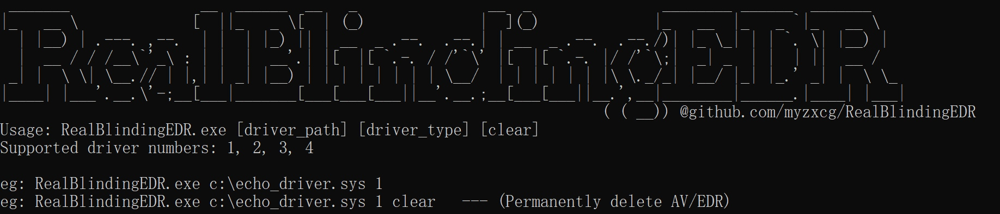
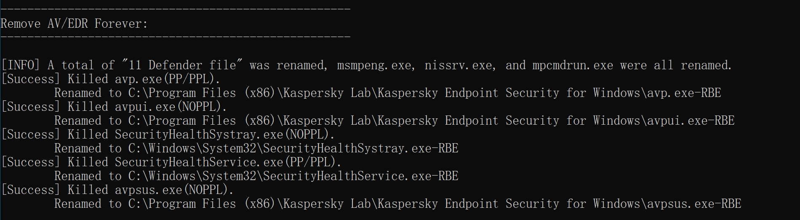

# RealBlindingEDR

[中文介绍](README.zh_CN.md)

**Note:** Starting from v1.5, only exe will be released and the source code will not be updated (except for bug fixes). If you have any needs or questions, please contact: bXl6LnhjZ0BnbWFpbC5jb20=

Utilize arbitrary address read/write implementation with signed driver: completely blind or kill or permanently turn off AV/EDR.

If you want to understand the implementation principle, you can refer to the analysis article: [AV/EDR 完全致盲 - 清除6大内核回调实现（Chinese）](https://mp.weixin.qq.com/s/ZMTjDMMdQoOczxzZ7OAGtA)

**Supports blinding/permanent shutdown: 360 Security Guard, 360 Enterprise Edition, Tianqing V10, Tencent Computer Manager, Tinder/Tinder Enterprise Edition, Kaspersky Endpoint Security, AsiaInfo EDR, Windows Defender, AnTian Zhijia.**

**Currently tested on 64-bit Windows 7/10/11 and Windows Server 2008R2/2012R2/2016/2019/2022. If you find a problem in a certain version, you can report it through issue and I will adapt it.**

## Introduction

This project implements the clearing of the following kernel callbacks:

1. Delete the callback registered by `CmRegisterCallback(Ex)`
2. Delete the callback registered by `MiniFilter driver`
3. Delete the callbacks registered by `ObRegisterCallbacks()`
4. Delete the callback registered by `PsSetCreateProcessNotifyRoutine(Ex)`
5. Delete the callback registered by `PsSetCreateThreadNotifyRoutine(Ex)`
6. Delete the callback registered by `PsSetLoadImageNotifyRoutine(Ex)`

**After deleting the kernel callback, the following 3 effects can finally be achieved:**

1. **Blinding AV/EDR**
    
     While keeping the AV/EDR process running normally, it makes it impossible to monitor any process/thread activity, any file landing, registry deletion, high-privilege handle acquisition and many other sensitive behaviors. (Not killing directly is to ensure that EDR maintains communication with the master control and avoid being discovered due to disconnection)
    
2. **Permanently turn off or disable AV/EDR**
    
     Since the registry and minifilter kernel notification callbacks are deleted, AV/EDR can be permanently turned off (even if the system is restarted) by modifying the registry or directly deleting the AV/EDR file.
    
3. **Kill AV/EDR process**
    
     Since the object handle notification callback has been removed, it is now possible to terminate the AV/EDR process with normal administrator user rights.

## Disclaimer

This project is not targeted at any AV/EDR manufacturers. The code examples are only for research and learning, and are not allowed to be used maliciously. If there is any malicious use, it has nothing to do with me.

## Usage

Download the exe file from Releases and do anti-virus processing (you can convert the exe into shellcode and write a shellcode loader to load it)

This project currently supports 4 types of driver applications (corresponding to the corresponding application numbers):
1. [echo_driver.sys](https://www.loldrivers.io/drivers/afb8bb46-1d13-407d-9866-1daa7c82ca63/) (support win10+)

2. [dbutil_2_3.sys](https://www.loldrivers.io/drivers/a4eabc75-edf6-4b74-9a24-6a26187adabf/) (support win7+)

3. wnBio.sys (supports Windows Version 6.3+)

4. [GPU-Z.sys](https://github.com/huoji120/Antivirus_R3_bypass_demo)(only supports Windows Version 6.1)

**example:**

1. Use the echo_driver.sys driver for blinding:
	
    `RealBlindingEDR.exe c:\echo_driver.sys 1`

2. Use the wnBio.sys driver to permanently remove the anti-virus software (essentially renaming the key files of the anti-virus software):
	
    `RealBlindingEDR.exe c:\wnBio.sys 3 clear`
    
    

**Tips:** If EDR marks these driver files, you can try to modify the hash value of the driver files without affecting the driver signature.

## Effect
The following demonstration content is not specific to this AV manufacturer, but is only for educational and research purposes. Most AV/EDR manufacturers are affected.

[DemoVideo](Demovideo.mp4)

1. Delete AV/EDR object handle monitoring and kill AV process
	
     
2. Delete AV/EDR registry monitoring and delete AV registry to permanently shut down AV
	
     

3. Delete file landing monitoring and AV/EDR own file protection, delete AV files to permanently close AV
	
     
## To be done
1. Clear the handles related to the Windows ETW event provider in the kernel.
2. Try removing WFP related callbacks.
3. ...
## Acknowledgments

Thanks to the following articles and projects for helping me.

1. [OBREGISTERCALLBACKS AND COUNTERMEASURES](https://douggemhax.wordpress.com/2015/05/27/obregistercallbacks-and-countermeasures/)
2. [Windows Anti-Debug techniques - OpenProcess filtering](https://blog.xpnsec.com/anti-debug-openprocess/)
3. [Mimidrv In Depth: Exploring Mimikatz’s Kernel Driver](https://medium.com/@matterpreter/mimidrv-in-depth-4d273d19e148)
4. [Part 1: Fs Minifilter Hooking](https://aviadshamriz.medium.com/part-1-fs-minifilter-hooking-7e743b042a9d)
5. [EchoDrv](https://github.com/YOLOP0wn/EchoDrv)
6. [Windows Kernel Ps Callbacks Experiments](http://blog.deniable.org/posts/windows-callbacks/)
7. [Silencing the EDR. How to disable process, threads and image-loading detection callbacks](https://www.matteomalvica.com/blog/2020/07/15/silencing-the-edr/)
8. [Removing-Kernel-Callbacks-Using-Signed-Drivers](https://br-sn.github.io/Removing-Kernel-Callbacks-Using-Signed-Drivers/)
9. [EchOh-No! a Vulnerability and PoC demonstration in a popular Minecraft AntiCheat tool](https://ioctl.fail/echo-ac-writeup/)